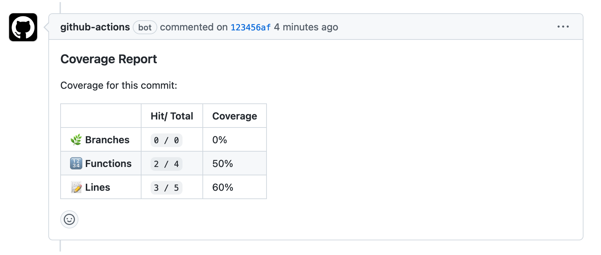

## kcjpop/coverage-comments@v2

A Github action to comment coverage data from a `clover.xml` or `lcov.info` file in commits/ PRs.

**Features:**

☘️ Support `clover.xml` or `lcov.info`
💬 Delete old comments to avoid spamming the conversation
✨ Clean, minimal comment
🥳 Emojies

**To be developed:**

- [ ] Config param to specify coverage comments on commits, PRs, or both
- [ ] Config param to show coverages of changed files only



## Usage

In your workflow:

```diff
jobs:
  your-job:
    runs-on: ubuntu-latest
+    # Require to specify permissions
+    permissions: write-all
    steps:
      - uses: actions/checkout@v3
      - uses: pnpm/action-setup@v2
        with:
          version: 7.30.0
      - run: pnpm install
      - run: pnpm test
+      # This needs to be run after a test job so coverage file will be available.
+      - uses: kcjpop/coverage-comments@v1
+        with:
+          coverage-file: './coverage/clover.xml'
```

## Configurations

| Parameter             | Description                                                               | Mandatory | Default value         |
| --------------------- | ------------------------------------------------------------------------- | --------- | --------------------- |
| `coverage-file`       | Path to `lcov.info` or `clover.xml` file                                  | Yes       |                       |
| `working-directory`   | Set working directory if project is not in root folder                    | No        | `'./'`                |
| `delete-old-comments` | Keep only one coverage comment, to avoid spamming a PR with outdated info | No        | `true`                |
| `github-token`        |                                                                           | No        | `${{ github.token }}` |

### Example: `lcov.info` is in a different folder

```yaml
- uses: kcjpop/coverage-comments@v1
  with:
    coverage-file: 'front/coverage/lcov.info'
```

## Acknowledgements

This codebase is largely based on prior work of [**romeovs/lcov-reporter-action**](https://github.com/romeovs/lcov-reporter-action).
