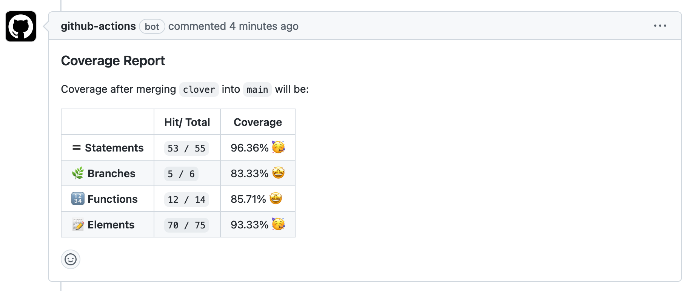

## kcjpop/coverage-comments

A Github action to extract coverage data from a `lcov.info` file and posted as comment in PRs/ commits.

**Features:**

✨ Clean, minimal comment

**To be developed:**

- [ ] Show statement coverage
- [ ] Config param to specify coverage comments on commits, PRs, or both
- [ ] Config param to show coverages of changed files only
- [ ] Emoji reactions based on coverage percentage



## Usage

In your workflow:

```yaml
jobs:
  your-javascript-job:
    …
    # Require to specify permissions
    permissions: write-all
    steps:
      …
      # This needs to run after a test runner so `lcov.info` file will
      # be available.
      - uses: kcjpop/coverage-comments@v1
```

## Configurations

| Parameter             | Description                                                               | Mandatory | Default value            |
| --------------------- | ------------------------------------------------------------------------- | --------- | ------------------------ |
| `github-token`        |                                                                           | Yes       | `${{ github.token }}`    |
| `lcov-file`           | Path to the `lcov.info` file                                              | No        | `'./coverage/lcov.info'` |
| `working-directory`   | Set working directory if project is not in root folder                    | No        | `'./'`                   |
| `delete-old-comments` | Keep only one coverage comment, to avoid spamming a PR with outdated info | No        | `true`                   |

### Example: `lcov.info` is in a different folder

```yaml
- uses: kcjpop/coverage-comments@v1
  with:
    lcov-file: front/coverage/lcov.info
```

## Acknowledgements

This codebase is largely based on prior work of [**romeovs/lcov-reporter-action**](https://github.com/romeovs/lcov-reporter-action).
